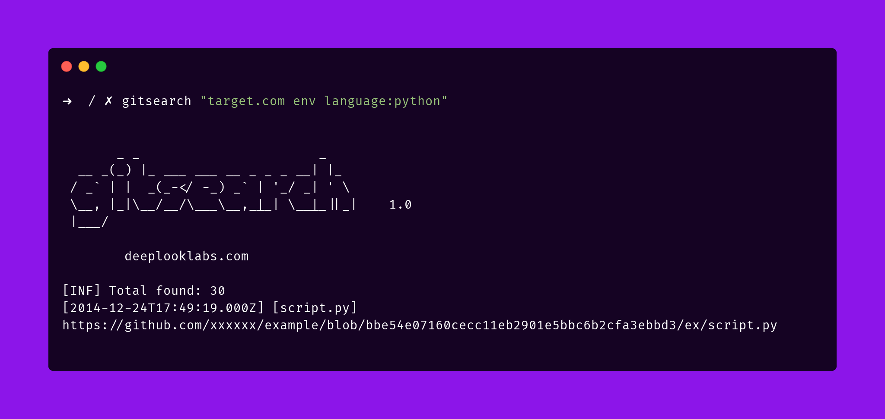

<h1 align="center">
  <br>
  <a href="https://deeplooklabs.com"></a>
</h1>

Searching github the way it worked...
## Install

```bash
go install github.com/deeplooklabs/gitsearch@latest

```

## Config:

### With enviroment:
Set enviroment GITHUB_TOKEN

```bash
export GITHUB_TOKEN=XXX; gitsearch -q SEARCH
```

### With parameter
```bash
gitsearch -q SEARCH -t TOKEN
```

## How to search:

> Search AWS keys on source python:
```bash
gitsearch -q "\"target\" \"AKIA\" boto language:python"
```

> Show only repository url:
```bash
gitsearch -q "\"target\" \"AKIA\" boto language:python" -r -silent | sort -u
```